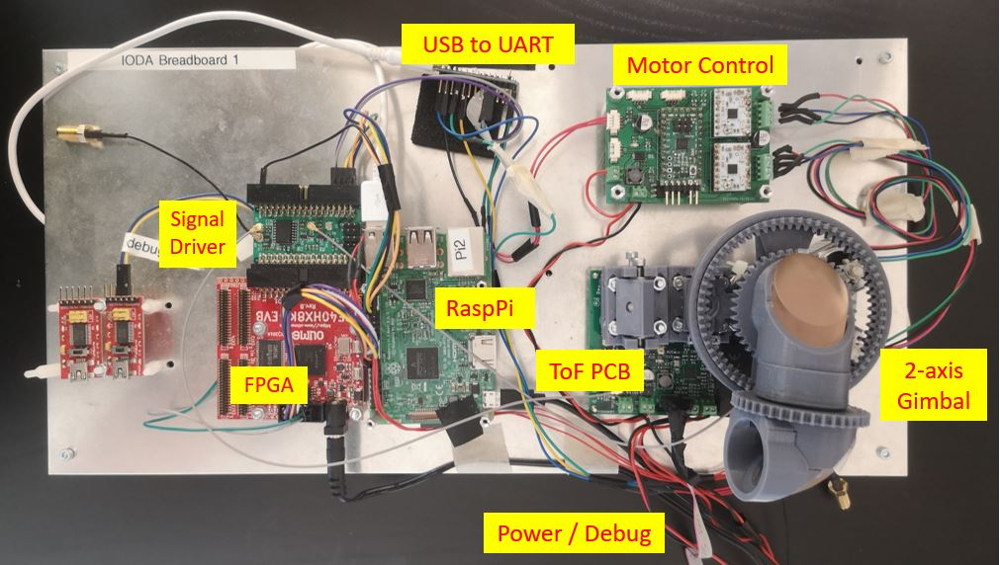

# IODA Lidar

This project implemnts a time-of-flight lidar from scratch.

## Components and Links

It comprised the following modules

- [Optical Transceiver PCB (Tof)](https://github.com/plex1/Tof_PCB)
  - Laser: Infrared 850nm high speed
  - Photo Diode: 2 options - either APD or Si photo multiplier array
  - Microcontroller for configuration and monitoring purposes
    - [Microcontroller software](https://github.com/plex1/TofPCB_SW)
- [Motor PCB](https://github.com/plex1/motor_control_pcb)
  - Microcontroller for profile and step/direction generation
    - [Microcontroller software](https://github.com/plex1/stepper)
  - PWM driver ICs
- [Signal Diver PCB](https://github.com/plex1/ice40_driver_pcb)
  - Drivers and recieved 50 Ohms high speed signal
  - Variable Delay IC for test and calibration purposes
- [FPGA board (Olimex)](https://www.olimex.com/Products/FPGA/iCE40/iCE40HX8K-EVB/open-source-hardware)
  - Tx Sync generation
  - time to digital converter implemented with LUTs (between Rx and Tx Sync)
  - histogram measurement
  - [FPGA logicware](https://github.com/plex1/SpinalDevTof)
- Raspberry Pi 3 Model B
  - For programming and debugging
- 2-axis Gimbal
  - indcluding focusing and ajustement optics
- [Python Software](https://github.com/plex1/ioda_control_sw)
  - Coordination of gimbal positio and time-of-flight data
  - Point cloud generation
  - [Software](https://github.com/plex1/ioda_control_sw)

## Tools Used

- PCBs: [KiCad](https://www.kicad.org/)
- Mechanics: Autodesk Fusion 360
- FPGA: [Yosys](https://github.com/YosysHQ/yosys) and [NextPnR](https://github.com/YosysHQ/nextpnr)
- Microcontroller: [Arduino](https://www.arduino.cc) and Atmel Visual Studio
- 
## Block Diagram

# Some Images

